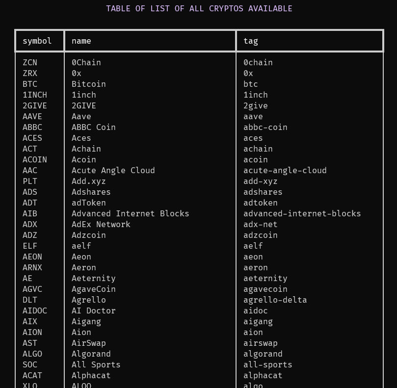
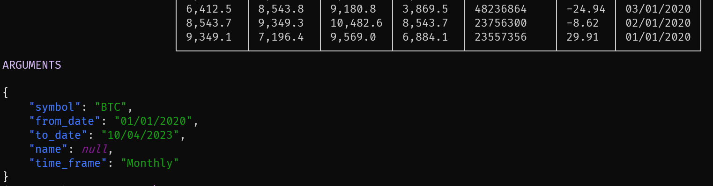

# <small>:octicons-terminal-16:</small> pinv

The library has a CLI named `pinv` that provides access to all the basic functions of the `Invest` class.

It uses subcommands to access the functions of the `Invest` class, with the advantage of configuring a configuration file.

#### How to use?

##### <custom style="color: green">:material-arrow-right-thin:</custom>help

```bash
pinv --help
```

The help command should return the following commands:

| Command | Description |
| :--- | :--- |
| --help | Help |
| config | Configuration |
| crypto | Functions of the `Crypto` class |

##### <custom style="color: green">:material-arrow-right-thin:</custom>config

!!! danger "Required Configuration"
    **If the email configuration is not done or if it is not informed with the --email parameter, the API will block all commands.**

```bash
pinv config
```

The configuration command should search for a file named pinv.ini inside the **_python_invest_** project folder. In this file, it should look for the **[api.config]** field, which should contain the value of **EMAIL** that will be used in the configuration of **Invest**.

_NOTE_: If the file does not exist, an interaction via shell will be done to quickly configure the file.

It is also possible to use the command `pinv config --help` to obtain more information about the command.

Other options:

```bash
pinv config --email youremail@email.com
```

You can also replicate the settings from an already configured file by passing the `--config-file` parameter.

```bash
pinv config --config-file config.ini
```

##### <custom style="color: green">:material-arrow-right-thin:</custom>crypto

The crypto command is based on the `Crypto` class, and it contains its main functions.

```bash
pinv crypto --help
```

The help command of the `crypto` subcommand should return the following commands:

| Command | Description |
| :--- | :--- |
| --help | Help |
| list | Lists all the cryptos that the API can handle |
| historical | Returns the historical data of a given crypto. |

All crypto commands have the following parameters:

| Parameter | Description |
| :--- | :--- |
| --email | The API user's email.. |
| --to-csv | Returns the data in CSV format. |

---

###### list

```bash
pinv crypto list
```

Result example:

{ width="500" .center .shadow }

---

###### historical

Get the historical data from crypto.

Example:

```bash
pinv crypto historical BTC
```

{ width="500" .center .shadow }

Some parameters have a default value, but you can change all parameters. For more information use the `--help` command.

---


Example with others options:

```bash
pinv crypto historical BTC --date-in '2023-01-01' --date-out '2023-04-01' --time-frame 'Monthly'
```

---

If you want to check the parameters used by the historical command, you can use the `--show-args` option.

```bash
pinv crypto historical BTC --show-args
```

{ width="650" .center .shadow }

---

If you want save the historical data in a CSV file, you can use the `--to-csv` option.

```bash
pinv crypto historical BTC --to-csv output.csv
```
